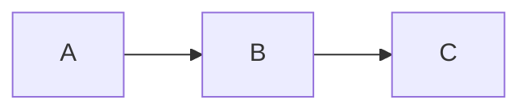

# md2html Skill Implementation Plan

> **For agentic workers:** REQUIRED SUB-SKILL: Use superpowers:subagent-driven-development (recommended) or superpowers:executing-plans to implement this plan task-by-task. Steps use checkbox (`- [ ]`) syntax for tracking.

**Goal:** Go CLI `md2html` + Claude Code 스킬을 만들어, 임의의 로컬 MD 파일을 aac-core PR #99의 인터랙티브 셸로 HTML 변환해 `/tmp/md2html/`에 생성·자동 오픈한다.

**Architecture:** goldmark 기반 단일 바이너리. 셸은 `//go:embed`로 박음. CLI는 절대 경로 MD 인자만 받고 변환·치환·파일 출력·브라우저 오픈을 수행. Claude는 자연어 발화를 절대 경로 인자로 변환해 호출.

**Tech Stack:** Go 1.21+, goldmark v1.7.x (`extension.GFM`만 사용), 표준 라이브러리(`//go:embed`, `os/exec`, `flag`).

**Spec 참조:** `/Users/user/aac/docs/superpowers/specs/2026-05-19-md2html-skill-design.md`

---

## 파일 구조

```
~/.claude/skills/md2html/
├── SKILL.md                # Claude 트리거 지시문
├── bin/
│   └── md2html             # 빌드 산출물 (gitignored)
└── src/
    ├── go.mod, go.sum
    ├── main.go             # CLI: arg parse, file I/O loop, browser open, exit code
    ├── convert.go          # Orchestration: parse, render, substitute, single MD→HTML
    ├── slugify.go          # 한글 슬러그 생성 (pure)
    ├── slugify_test.go
    ├── toc.go              # AST 1-pass: TOC 빌드 + title 추출
    ├── toc_test.go
    ├── renderer.go         # custom NodeRenderers: heading, code, list-item, link
    ├── renderer_test.go
    ├── shell.html          # //go:embed 대상 (aac-core 셸 복사본)
    ├── .gitignore          # bin/, *.test
    └── testdata/
        ├── sample.md       # 통합 테스트 입력
        └── sample.html     # golden 출력
```

각 파일의 책임은 좁고 명확하다. `convert.go`는 호출 흐름만 묶는 얇은 파일. 변환 규칙은 `renderer.go`에 집중. 슬러그·TOC는 별 파일로 분리해 단위 테스트가 쉬움.

---

## Phase 1 — 스킬 디렉터리 초기화 (Tasks 1-4)

### Task 1: 스킬 디렉터리·git 초기화

**Files:**
- Create: `~/.claude/skills/md2html/src/go.mod`
- Create: `~/.claude/skills/md2html/src/.gitignore`

- [ ] **Step 1: 디렉터리 생성**

```bash
mkdir -p ~/.claude/skills/md2html/{src,bin}
mkdir -p ~/.claude/skills/md2html/src/testdata
```

- [ ] **Step 2: git init**

```bash
cd ~/.claude/skills/md2html && git init && git branch -m main
```

- [ ] **Step 3: go.mod 작성**

```bash
cd ~/.claude/skills/md2html/src
go mod init md2html
```

- [ ] **Step 4: .gitignore 작성**

`~/.claude/skills/md2html/src/.gitignore`:

```
*.test
```

`~/.claude/skills/md2html/.gitignore`:

```
bin/
```

- [ ] **Step 5: goldmark 의존성 추가**

```bash
cd ~/.claude/skills/md2html/src
go get github.com/yuin/goldmark@latest
```

- [ ] **Step 6: 검증**

```bash
cd ~/.claude/skills/md2html/src
go list -m all
```
Expected: `md2html`, `github.com/yuin/goldmark vX.X.X` 두 줄 이상.

- [ ] **Step 7: Commit**

```bash
cd ~/.claude/skills/md2html
git add -A
git commit -m "chore: init md2html skill skeleton"
```

---

### Task 2: 셸 파일 복사

**Files:**
- Create: `~/.claude/skills/md2html/src/shell.html` (aac-core 복사본, ~30KB)

- [ ] **Step 1: 복사**

```bash
cp /Users/user/aac/aac-core/spec/templates/html-shell.html \
   ~/.claude/skills/md2html/src/shell.html
```

- [ ] **Step 2: 검증 — placeholder 3개 확인**

```bash
grep -c "{{TITLE}}\|{{TOC}}\|{{CONTENT}}" ~/.claude/skills/md2html/src/shell.html
```
Expected: `3` (정확히 세 placeholder).

- [ ] **Step 3: Commit**

```bash
cd ~/.claude/skills/md2html
git add src/shell.html
git commit -m "feat: bundle aac-core html-shell.html (PR #99)"
```

---

### Task 3: SKILL.md 작성

**Files:**
- Create: `~/.claude/skills/md2html/SKILL.md`

- [ ] **Step 1: SKILL.md 작성**

```markdown
---
name: md2html
description: 로컬 MD 파일을 aac-core PR #99의 인터랙티브 셸로 HTML 변환해 브라우저에서 본다. /tmp/md2html/<원본명>.html 생성 후 자동 오픈.
---

# md2html — MD를 HTML로 보기

aac-core PR #99의 인터랙티브 셸(상태 칩, API 배지, 검색, sticky 칩 바 등 19종 자동 강화)을 임의의 로컬 MD 파일에 적용해 브라우저로 열어준다.

## 사용

인자: $ARGUMENTS

사용자가 다음과 같이 요청할 때:
- "이 md 파일 html로 보여줘"
- "/md2html foo.md"
- "spec.md, design.md를 html로 변환해줘"
- "이 폴더의 모든 md를 html로 보고싶어" (glob 후 인자로 풀어 호출)

### 실행

대상 MD 파일을 절대 경로로 변환한 뒤 한 번에 호출:

\`\`\`bash
~/.claude/skills/md2html/bin/md2html <abs-path-1> [<abs-path-2> ...]
\`\`\`

### 동작
- 출력: \`/tmp/md2html/<basename>.html\`
- 첫 파일은 macOS \`open\`으로 브라우저 자동 오픈
- 동명 파일 충돌 시 \`-2\`, \`-3\` 접미사로 자동 회피

### 옵션 (필요할 때만 전달)
- \`--no-open\` — 브라우저 자동 오픈 끄기
- \`--out-dir <path>\` — 출력 디렉터리 변경 (기본 \`/tmp/md2html\`)
- \`--shell <path>\` — 다른 셸 사용 (실험·디버그용)
- \`--no-link-rewrite\` — \`.md\` → \`.html\` 상대 링크 재작성 끄기

### 빌드 / 재설치

바이너리가 없거나 소스를 변경했다면:

\`\`\`bash
cd ~/.claude/skills/md2html/src && go build -o ../bin/md2html .
\`\`\`

\`go\`가 없으면: \`brew install go\`
```

- [ ] **Step 2: Commit**

```bash
cd ~/.claude/skills/md2html
git add SKILL.md
git commit -m "feat: SKILL.md trigger instructions"
```

---

### Task 4: main.go 스켈레톤 + 첫 빌드

**Files:**
- Create: `~/.claude/skills/md2html/src/main.go`

- [ ] **Step 1: 최소 main.go 작성**

`~/.claude/skills/md2html/src/main.go`:

```go
package main

import (
	"fmt"
	"os"
)

func main() {
	fmt.Fprintln(os.Stderr, "md2html: not implemented yet")
	os.Exit(1)
}
```

- [ ] **Step 2: 빌드 검증**

```bash
cd ~/.claude/skills/md2html/src
go build -o ../bin/md2html .
~/.claude/skills/md2html/bin/md2html
```
Expected: stderr에 `md2html: not implemented yet`, exit 1.

- [ ] **Step 3: Commit**

```bash
cd ~/.claude/skills/md2html
git add src/main.go
git commit -m "chore: main.go skeleton + first build"
```

---

## Phase 2 — Slugify (Tasks 5-6)

### Task 5: slugify_test.go (실패 테스트)

**Files:**
- Create: `~/.claude/skills/md2html/src/slugify_test.go`

- [ ] **Step 1: 테스트 작성**

`~/.claude/skills/md2html/src/slugify_test.go`:

```go
package main

import "testing"

func TestSlugify(t *testing.T) {
	tests := []struct {
		in   string
		want string
	}{
		{"API 설계", "api-설계"},
		{"1. 개요", "1-개요"},
		{"Hello, World!", "hello-world"},
		{"foo / bar : baz . qux", "foo-bar-baz-qux"},
		{"  공백  양옆  ", "공백-양옆"},
		{"a—b·c(d)", "abcd"},
		{"", ""},
		{"한글", "한글"},
		{"Mixed 한글 English", "mixed-한글-english"},
	}
	for _, tt := range tests {
		got := slugify(tt.in)
		if got != tt.want {
			t.Errorf("slugify(%q) = %q, want %q", tt.in, got, tt.want)
		}
	}
}

func TestSlugifyCollisionResolver(t *testing.T) {
	r := NewSlugResolver()
	if got := r.Resolve("api 설계"); got != "api-설계" {
		t.Errorf("first call: got %q, want %q", got, "api-설계")
	}
	if got := r.Resolve("api 설계"); got != "api-설계-2" {
		t.Errorf("second call: got %q, want %q", got, "api-설계-2")
	}
	if got := r.Resolve("api 설계"); got != "api-설계-3" {
		t.Errorf("third call: got %q, want %q", got, "api-설계-3")
	}
}
```

- [ ] **Step 2: 실패 확인**

```bash
cd ~/.claude/skills/md2html/src && go test -run TestSlugify
```
Expected: FAIL with `undefined: slugify` / `undefined: NewSlugResolver`.

---

### Task 6: slugify.go 구현

**Files:**
- Create: `~/.claude/skills/md2html/src/slugify.go`

- [ ] **Step 1: 구현 작성**

`~/.claude/skills/md2html/src/slugify.go`:

```go
package main

import (
	"fmt"
	"strings"
	"unicode"
)

// slugify converts a heading's plain text into an anchor ID per PR #99 guide:
// - lowercase
// - replace spaces, "/", ".", ":" with "-"
// - drop other non-word characters (Korean is kept)
// - collapse consecutive "-" and trim leading/trailing "-"
func slugify(s string) string {
	s = strings.ToLower(strings.TrimSpace(s))
	var b strings.Builder
	for _, r := range s {
		switch {
		case r == ' ' || r == '/' || r == '.' || r == ':':
			b.WriteRune('-')
		case r == '-' || r == '_':
			b.WriteRune('-')
		case unicode.IsLetter(r) || unicode.IsDigit(r):
			b.WriteRune(r)
		default:
			// drop other non-word characters (·, —, (, ), !, , etc.)
		}
	}
	// collapse runs of "-"
	out := b.String()
	for strings.Contains(out, "--") {
		out = strings.ReplaceAll(out, "--", "-")
	}
	return strings.Trim(out, "-")
}

// SlugResolver tracks slugs already used in a single document and resolves
// collisions by appending -2, -3, ...
type SlugResolver struct {
	seen map[string]int
}

func NewSlugResolver() *SlugResolver {
	return &SlugResolver{seen: map[string]int{}}
}

func (r *SlugResolver) Resolve(text string) string {
	base := slugify(text)
	n := r.seen[base]
	r.seen[base] = n + 1
	if n == 0 {
		return base
	}
	return fmt.Sprintf("%s-%d", base, n+1)
}
```

- [ ] **Step 2: 테스트 통과 확인**

```bash
cd ~/.claude/skills/md2html/src && go test -run TestSlugify -v
```
Expected: PASS.

- [ ] **Step 3: Commit**

```bash
cd ~/.claude/skills/md2html
git add src/slugify.go src/slugify_test.go
git commit -m "feat(slugify): Korean-friendly heading slug + collision resolver"
```

---

## Phase 3 — TOC + Title (Tasks 7-8)

### Task 7: toc_test.go (실패 테스트)

**Files:**
- Create: `~/.claude/skills/md2html/src/toc_test.go`

- [ ] **Step 1: 테스트 작성**

`~/.claude/skills/md2html/src/toc_test.go`:

```go
package main

import (
	"strings"
	"testing"

	"github.com/yuin/goldmark"
	"github.com/yuin/goldmark/text"
)

func parseAST(src string) (goldmark.Markdown, []byte, interface{}) {
	md := goldmark.New()
	source := []byte(src)
	doc := md.Parser().Parse(text.NewReader(source))
	return md, source, doc
}

func TestExtractTitle_FirstH1(t *testing.T) {
	_, source, doc := parseAST("# Hello World\n## sub\nbody")
	got := extractTitle(doc.(rootNode), source, "fallback")
	if got != "Hello World" {
		t.Errorf("got %q, want %q", got, "Hello World")
	}
}

func TestExtractTitle_FallbackToFilename(t *testing.T) {
	_, source, doc := parseAST("no heading here\njust body")
	got := extractTitle(doc.(rootNode), source, "fallback")
	if got != "fallback" {
		t.Errorf("got %q, want %q", got, "fallback")
	}
}

func TestBuildTOC_H2H3Only(t *testing.T) {
	src := "# Title\n## 개요\n### 배경\n### 목표\n## 수용 기준\n#### 너무 깊음\n"
	_, source, doc := parseAST(src)
	resolver := NewSlugResolver()
	toc := buildTOC(doc.(rootNode), source, resolver)
	want := []string{"개요", "배경", "목표", "수용 기준"}
	for _, w := range want {
		if !strings.Contains(toc, w) {
			t.Errorf("TOC missing %q\nTOC:\n%s", w, toc)
		}
	}
	if strings.Contains(toc, "너무 깊음") {
		t.Errorf("TOC must not include h4: %s", toc)
	}
	if strings.Contains(toc, "Title") {
		t.Errorf("TOC must not include h1: %s", toc)
	}
}

func TestBuildTOC_Empty(t *testing.T) {
	_, source, doc := parseAST("just text, no heading")
	toc := buildTOC(doc.(rootNode), source, NewSlugResolver())
	if !strings.Contains(toc, "(목차 없음)") {
		t.Errorf("expected '(목차 없음)' fallback, got: %s", toc)
	}
}
```

- [ ] **Step 2: 실패 확인**

```bash
cd ~/.claude/skills/md2html/src && go test -run "TestExtractTitle|TestBuildTOC"
```
Expected: FAIL with `undefined: extractTitle` / `undefined: buildTOC` / `undefined: rootNode`.

---

### Task 8: toc.go 구현

**Files:**
- Create: `~/.claude/skills/md2html/src/toc.go`

- [ ] **Step 1: 구현 작성**

`~/.claude/skills/md2html/src/toc.go`:

```go
package main

import (
	"strings"

	"github.com/yuin/goldmark/ast"
)

// rootNode is what goldmark's Parser().Parse() returns. We expose this alias
// so tests can pass the parser result through `interface{}` cleanly.
type rootNode = ast.Node

// headingIDAttr is the AST attribute key under which buildTOC stores the
// resolved slug ID for h1/h2/h3 nodes. The heading renderer reads it back
// during render, ensuring h2/h3 IDs match the TOC links exactly.
const headingIDAttr = "__md2html_id"

// extractTitle returns the plain text of the first H1 in the document, or
// fallback if none.
func extractTitle(doc rootNode, source []byte, fallback string) string {
	var title string
	ast.Walk(doc, func(n ast.Node, entering bool) (ast.WalkStatus, error) {
		if !entering {
			return ast.WalkContinue, nil
		}
		if h, ok := n.(*ast.Heading); ok && h.Level == 1 {
			title = string(h.Text(source))
			return ast.WalkStop, nil
		}
		return ast.WalkContinue, nil
	})
	if title == "" {
		return fallback
	}
	return title
}

// buildTOC walks h1/h2/h3 in one pass with a SHARED resolver so the resolved
// IDs are stable for both the heading renderer and the TOC links. It writes
// each resolved ID onto the heading node via headingIDAttr, then emits TOC
// HTML for h2/h3 only (h1 IDs are still assigned for anchor links but are
// not listed in TOC). Returns "<p>(목차 없음)</p>" if no h2/h3 found.
func buildTOC(doc rootNode, source []byte, resolver *SlugResolver) string {
	type entry struct {
		level int
		text  string
		id    string
	}
	var entries []entry
	ast.Walk(doc, func(n ast.Node, entering bool) (ast.WalkStatus, error) {
		if !entering {
			return ast.WalkContinue, nil
		}
		h, ok := n.(*ast.Heading)
		if !ok || h.Level < 1 || h.Level > 3 {
			return ast.WalkContinue, nil
		}
		text := string(h.Text(source))
		id := resolver.Resolve(text)
		h.SetAttributeString(headingIDAttr, []byte(id))
		if h.Level == 2 || h.Level == 3 {
			entries = append(entries, entry{h.Level, text, id})
		}
		return ast.WalkContinue, nil
	})
	if len(entries) == 0 {
		return "<p>(목차 없음)</p>"
	}

	var b strings.Builder
	b.WriteString("<ul>\n")
	inH2 := false
	inH3List := false
	for _, e := range entries {
		if e.level == 2 {
			if inH3List {
				b.WriteString("    </ul>\n")
				inH3List = false
			}
			if inH2 {
				b.WriteString("  </li>\n")
			}
			b.WriteString("  <li><a href=\"#" + e.id + "\">" + escapeHTML(e.text) + "</a>")
			inH2 = true
		} else { // level 3
			if !inH3List {
				b.WriteString("\n    <ul>\n")
				inH3List = true
			}
			b.WriteString("      <li><a href=\"#" + e.id + "\">" + escapeHTML(e.text) + "</a></li>\n")
		}
	}
	if inH3List {
		b.WriteString("    </ul>\n")
	}
	if inH2 {
		b.WriteString("  </li>\n")
	}
	b.WriteString("</ul>")
	return b.String()
}

func escapeHTML(s string) string {
	r := strings.NewReplacer("&", "&amp;", "<", "&lt;", ">", "&gt;", "\"", "&quot;")
	return r.Replace(s)
}
```

- [ ] **Step 2: 테스트 통과 확인**

```bash
cd ~/.claude/skills/md2html/src && go test -run "TestExtractTitle|TestBuildTOC" -v
```
Expected: PASS for all 4 tests.

- [ ] **Step 3: Commit**

```bash
cd ~/.claude/skills/md2html
git add src/toc.go src/toc_test.go
git commit -m "feat(toc): h1 title extraction + h2/h3 TOC builder"
```

---

## Phase 4 — Custom NodeRenderers (Tasks 9-12)

`renderer.go`는 4개 custom renderer를 한 파일에 모은다. 각 Task가 하나의 renderer를 책임지고 점진적으로 추가한다.

### Task 9: Heading renderer (한글 슬러그 ID)

**Files:**
- Create: `~/.claude/skills/md2html/src/renderer.go`
- Create: `~/.claude/skills/md2html/src/renderer_test.go`

- [ ] **Step 1: 실패 테스트 작성**

`~/.claude/skills/md2html/src/renderer_test.go`:

```go
package main

import (
	"strings"
	"testing"
)

func renderHTML(t *testing.T, src string) string {
	t.Helper()
	out, _, _, err := convertMarkdown([]byte(src), ConvertOptions{LinkRewrite: true})
	if err != nil {
		t.Fatalf("convertMarkdown error: %v", err)
	}
	return out
}

func TestHeading_KoreanSlugID(t *testing.T) {
	html := renderHTML(t, "## API 설계\n### 1. 개요")
	if !strings.Contains(html, `id="api-설계"`) {
		t.Errorf("missing korean slug id on h2:\n%s", html)
	}
	if !strings.Contains(html, `id="1-개요"`) {
		t.Errorf("missing slug id on h3:\n%s", html)
	}
}

func TestHeading_CollisionSuffix(t *testing.T) {
	html := renderHTML(t, "## 개요\n## 개요\n## 개요")
	if !strings.Contains(html, `id="개요"`) ||
		!strings.Contains(html, `id="개요-2"`) ||
		!strings.Contains(html, `id="개요-3"`) {
		t.Errorf("collision suffix not applied:\n%s", html)
	}
}
```

- [ ] **Step 2: renderer.go 초안 + convertMarkdown 시그니처**

`~/.claude/skills/md2html/src/renderer.go`:

```go
package main

import (
	"bytes"
	"fmt"
	"net/url"
	"strings"

	"github.com/yuin/goldmark"
	"github.com/yuin/goldmark/ast"
	"github.com/yuin/goldmark/extension"
	"github.com/yuin/goldmark/parser"
	"github.com/yuin/goldmark/renderer"
	"github.com/yuin/goldmark/renderer/html"
	"github.com/yuin/goldmark/text"
	"github.com/yuin/goldmark/util"
)

type ConvertOptions struct {
	LinkRewrite bool
}

// convertMarkdown parses + renders markdown bytes per PR #99 guide.
// Returns: rendered HTML body, title (first h1 or empty), TOC HTML, error.
func convertMarkdown(src []byte, opts ConvertOptions) (htmlOut, title, tocHTML string, err error) {
	md := goldmark.New(
		goldmark.WithExtensions(extension.GFM),
		goldmark.WithParserOptions(),
		goldmark.WithRendererOptions(html.WithUnsafe()),
	)

	doc := md.Parser().Parse(text.NewReader(src))

	// Single pass: buildTOC walks h1/h2/h3, assigns slug IDs onto each heading
	// node (via headingIDAttr), and returns TOC HTML for h2/h3 only. The heading
	// renderer below reads the stored attribute back. This guarantees TOC links
	// and heading IDs match even when h1/h2 texts collide.
	tocHTML = buildTOC(doc, src, NewSlugResolver())
	title = extractTitle(doc, src, "")

	// Register our custom renderers on top of goldmark's default HTML renderer.
	md.Renderer().AddOptions(
		renderer.WithNodeRenderers(
			util.Prioritized(&headingRenderer{}, 100),
			util.Prioritized(&codeBlockRenderer{}, 100),
			util.Prioritized(&taskListRenderer{}, 100),
			util.Prioritized(&linkRenderer{rewrite: opts.LinkRewrite}, 100),
		),
	)

	var buf bytes.Buffer
	if err := md.Renderer().Render(&buf, src, doc); err != nil {
		return "", "", "", fmt.Errorf("render: %w", err)
	}
	return buf.String(), title, tocHTML, nil
}

// --- heading ---
// headingIDAttr is defined in toc.go; the renderer here only reads it.

type headingRenderer struct{}

func (r *headingRenderer) RegisterFuncs(reg renderer.NodeRendererFuncRegisterer) {
	reg.Register(ast.KindHeading, r.render)
}

func (r *headingRenderer) render(w util.BufWriter, source []byte, node ast.Node, entering bool) (ast.WalkStatus, error) {
	h := node.(*ast.Heading)
	if entering {
		idAttr, _ := h.AttributeString(headingIDAttr)
		idBytes, _ := idAttr.([]byte)
		if h.Level >= 1 && h.Level <= 3 && len(idBytes) > 0 {
			fmt.Fprintf(w, `<h%d id="%s">`, h.Level, string(idBytes))
		} else {
			fmt.Fprintf(w, `<h%d>`, h.Level)
		}
	} else {
		fmt.Fprintf(w, "</h%d>\n", h.Level)
	}
	return ast.WalkContinue, nil
}

// --- placeholder stubs for next tasks (so package compiles) ---

type codeBlockRenderer struct{}

func (r *codeBlockRenderer) RegisterFuncs(reg renderer.NodeRendererFuncRegisterer) {}

type taskListRenderer struct{}

func (r *taskListRenderer) RegisterFuncs(reg renderer.NodeRendererFuncRegisterer) {}

type linkRenderer struct{ rewrite bool }

func (r *linkRenderer) RegisterFuncs(reg renderer.NodeRendererFuncRegisterer) {}

// --- helpers used by later renderers ---

var _ = url.PathEscape // suppress unused import until link renderer task
```

- [ ] **Step 3: 테스트 통과 확인**

```bash
cd ~/.claude/skills/md2html/src && go test -run "TestHeading" -v
```
Expected: PASS for `TestHeading_KoreanSlugID` and `TestHeading_CollisionSuffix`.

- [ ] **Step 4: Commit**

```bash
cd ~/.claude/skills/md2html
git add src/renderer.go src/renderer_test.go
git commit -m "feat(renderer): heading with Korean slug IDs"
```

---

### Task 10: 코드 블록 renderer (Mermaid 분기)

**Files:**
- Modify: `~/.claude/skills/md2html/src/renderer.go`
- Modify: `~/.claude/skills/md2html/src/renderer_test.go`

- [ ] **Step 1: 실패 테스트 추가**

`renderer_test.go`에 다음 함수 추가:

```go
func TestCodeBlock_MermaidBranch(t *testing.T) {
	html := renderHTML(t, "```mermaid\nflowchart LR\n  A --> B\n```")
	if !strings.Contains(html, `<pre class="mermaid">`) {
		t.Errorf("mermaid block must use <pre class=\"mermaid\">:\n%s", html)
	}
	if strings.Contains(html, `language-mermaid`) {
		t.Errorf("mermaid block must not have language-* class:\n%s", html)
	}
	if !strings.Contains(html, "flowchart LR") {
		t.Errorf("mermaid content missing:\n%s", html)
	}
}

func TestCodeBlock_RegularLanguage(t *testing.T) {
	html := renderHTML(t, "```go\nfmt.Println(\"hi\")\n```")
	if !strings.Contains(html, `<pre><code class="language-go">`) {
		t.Errorf("regular code block must use <pre><code class=\"language-X\">:\n%s", html)
	}
	if !strings.Contains(html, `fmt.Println(&#34;hi&#34;)`) && !strings.Contains(html, `fmt.Println(&quot;hi&quot;)`) {
		t.Errorf("content must be HTML-escaped:\n%s", html)
	}
}

func TestCodeBlock_NoLanguage(t *testing.T) {
	html := renderHTML(t, "```\nplain text\n```")
	if !strings.Contains(html, `<pre><code class="language-plaintext">`) {
		t.Errorf("missing lang must default to plaintext:\n%s", html)
	}
}

func TestCodeBlock_MermaidEscape(t *testing.T) {
	html := renderHTML(t, "```mermaid\nA-->>B: Mono<Foo>\n```")
	// inside <pre class="mermaid">, < and > must be HTML-escaped so the browser
	// returns the original source via textContent.
	if !strings.Contains(html, "Mono&lt;Foo&gt;") {
		t.Errorf("mermaid content must be HTML-escaped:\n%s", html)
	}
}
```

- [ ] **Step 2: 실패 확인**

```bash
cd ~/.claude/skills/md2html/src && go test -run "TestCodeBlock" -v
```
Expected: FAIL (goldmark default 사용 중이라 mermaid 분기 없음).

- [ ] **Step 3: codeBlockRenderer 구현 — 기존 stub 교체**

`renderer.go`의 `codeBlockRenderer` stub과 `RegisterFuncs`를 다음으로 교체:

```go
type codeBlockRenderer struct{}

func (r *codeBlockRenderer) RegisterFuncs(reg renderer.NodeRendererFuncRegisterer) {
	reg.Register(ast.KindFencedCodeBlock, r.renderFenced)
	reg.Register(ast.KindCodeBlock, r.renderIndented)
}

func (r *codeBlockRenderer) renderFenced(w util.BufWriter, source []byte, node ast.Node, entering bool) (ast.WalkStatus, error) {
	if !entering {
		return ast.WalkContinue, nil
	}
	cb := node.(*ast.FencedCodeBlock)
	lang := string(cb.Language(source))
	body := readNodeText(cb, source)

	if lang == "mermaid" {
		fmt.Fprintf(w, `<pre class="mermaid">%s</pre>`+"\n", escapeHTML(body))
		return ast.WalkSkipChildren, nil
	}
	if lang == "" {
		lang = "plaintext"
	}
	fmt.Fprintf(w, `<pre><code class="language-%s">%s</code></pre>`+"\n", lang, escapeHTML(body))
	return ast.WalkSkipChildren, nil
}

func (r *codeBlockRenderer) renderIndented(w util.BufWriter, source []byte, node ast.Node, entering bool) (ast.WalkStatus, error) {
	if !entering {
		return ast.WalkContinue, nil
	}
	body := readNodeText(node, source)
	fmt.Fprintf(w, `<pre><code class="language-plaintext">%s</code></pre>`+"\n", escapeHTML(body))
	return ast.WalkSkipChildren, nil
}

func readNodeText(n ast.Node, source []byte) string {
	var b strings.Builder
	for i := 0; i < n.Lines().Len(); i++ {
		seg := n.Lines().At(i)
		b.Write(seg.Value(source))
	}
	return b.String()
}
```

- [ ] **Step 4: 테스트 통과 확인**

```bash
cd ~/.claude/skills/md2html/src && go test -run "TestCodeBlock" -v
```
Expected: PASS for all 4 code block tests.

- [ ] **Step 5: Commit**

```bash
cd ~/.claude/skills/md2html
git add src/renderer.go src/renderer_test.go
git commit -m "feat(renderer): code block + Mermaid branching"
```

---

### Task 11: Task list renderer

**Files:**
- Modify: `~/.claude/skills/md2html/src/renderer.go`
- Modify: `~/.claude/skills/md2html/src/renderer_test.go`

- [ ] **Step 1: 실패 테스트 추가**

`renderer_test.go`에 추가:

```go
func TestTaskList_Classes(t *testing.T) {
	html := renderHTML(t, "- [ ] todo\n- [x] done\n")
	if !strings.Contains(html, `<ul class="contains-task-list">`) {
		t.Errorf("missing contains-task-list class on ul:\n%s", html)
	}
	occ := strings.Count(html, `<li class="task-list-item">`)
	if occ != 2 {
		t.Errorf("expected 2 task-list-item, got %d:\n%s", occ, html)
	}
	if !strings.Contains(html, `<input type="checkbox" disabled>`) {
		t.Errorf("missing disabled checkbox:\n%s", html)
	}
	if !strings.Contains(html, `<input type="checkbox" checked disabled>`) &&
		!strings.Contains(html, `<input type="checkbox" disabled checked>`) {
		t.Errorf("missing checked checkbox:\n%s", html)
	}
}

func TestTaskList_PlainList_NoClass(t *testing.T) {
	html := renderHTML(t, "- one\n- two\n")
	if strings.Contains(html, "contains-task-list") || strings.Contains(html, "task-list-item") {
		t.Errorf("plain list should not have task-list classes:\n%s", html)
	}
}
```

- [ ] **Step 2: 실패 확인**

```bash
cd ~/.claude/skills/md2html/src && go test -run "TestTaskList" -v
```
Expected: FAIL.

- [ ] **Step 3: taskListRenderer 구현 — 기존 stub 교체**

`renderer.go`의 `taskListRenderer` stub을 다음으로 교체:

```go
type taskListRenderer struct{}

func (r *taskListRenderer) RegisterFuncs(reg renderer.NodeRendererFuncRegisterer) {
	reg.Register(ast.KindList, r.renderList)
	reg.Register(ast.KindListItem, r.renderListItem)
	reg.Register(extension.KindTaskCheckBox, r.renderTaskCheckBox)
}

func (r *taskListRenderer) renderList(w util.BufWriter, source []byte, node ast.Node, entering bool) (ast.WalkStatus, error) {
	list := node.(*ast.List)
	tag := "ul"
	if list.IsOrdered() {
		tag = "ol"
	}
	if entering {
		if listContainsTask(list) {
			fmt.Fprintf(w, `<%s class="contains-task-list">`+"\n", tag)
		} else {
			fmt.Fprintf(w, `<%s>`+"\n", tag)
		}
	} else {
		fmt.Fprintf(w, "</%s>\n", tag)
	}
	return ast.WalkContinue, nil
}

func (r *taskListRenderer) renderListItem(w util.BufWriter, source []byte, node ast.Node, entering bool) (ast.WalkStatus, error) {
	li := node.(*ast.ListItem)
	if entering {
		if listItemIsTask(li) {
			fmt.Fprint(w, `<li class="task-list-item">`)
		} else {
			fmt.Fprint(w, `<li>`)
		}
	} else {
		fmt.Fprint(w, "</li>\n")
	}
	return ast.WalkContinue, nil
}

func (r *taskListRenderer) renderTaskCheckBox(w util.BufWriter, source []byte, node ast.Node, entering bool) (ast.WalkStatus, error) {
	if !entering {
		return ast.WalkContinue, nil
	}
	cb := node.(*extension.TaskCheckBox)
	if cb.IsChecked {
		fmt.Fprint(w, `<input type="checkbox" checked disabled> `)
	} else {
		fmt.Fprint(w, `<input type="checkbox" disabled> `)
	}
	return ast.WalkContinue, nil
}

func listItemIsTask(li *ast.ListItem) bool {
	for child := li.FirstChild(); child != nil; child = child.NextSibling() {
		if _, ok := child.(*ast.TextBlock); !ok {
			if _, ok := child.(*ast.Paragraph); !ok {
				continue
			}
		}
		for inline := child.FirstChild(); inline != nil; inline = inline.NextSibling() {
			if _, ok := inline.(*extension.TaskCheckBox); ok {
				return true
			}
		}
	}
	return false
}

func listContainsTask(list *ast.List) bool {
	for item := list.FirstChild(); item != nil; item = item.NextSibling() {
		if li, ok := item.(*ast.ListItem); ok && listItemIsTask(li) {
			return true
		}
	}
	return false
}
```

Imports 추가 — `renderer.go` 상단의 `import` 블록에 다음이 이미 있는지 확인하고 없으면 추가:

```go
"github.com/yuin/goldmark/extension"
```

(Task 9에서 이미 추가됨; 빠져있으면 추가)

- [ ] **Step 4: 테스트 통과 확인**

```bash
cd ~/.claude/skills/md2html/src && go test -run "TestTaskList" -v
```
Expected: PASS.

- [ ] **Step 5: 회귀 확인 — 이전 테스트도 모두 통과**

```bash
cd ~/.claude/skills/md2html/src && go test -v
```
Expected: PASS for slugify, heading, code block, task list. (toc 테스트는 별도로 PASS여야 함)

- [ ] **Step 6: Commit**

```bash
cd ~/.claude/skills/md2html
git add src/renderer.go src/renderer_test.go
git commit -m "feat(renderer): task list with contains-task-list and task-list-item classes"
```

---

### Task 12: Link renderer (.md → .html 재작성)

**Files:**
- Modify: `~/.claude/skills/md2html/src/renderer.go`
- Modify: `~/.claude/skills/md2html/src/renderer_test.go`

- [ ] **Step 1: 실패 테스트 추가**

`renderer_test.go`에 추가:

```go
func TestLink_RelativeMdToHtml(t *testing.T) {
	html := renderHTML(t, "[design](./design.md)")
	if !strings.Contains(html, `href="./design.html"`) {
		t.Errorf("expected .md → .html rewrite:\n%s", html)
	}
}

func TestLink_FragmentPreserved(t *testing.T) {
	html := renderHTML(t, "[overview](../../overview.md#목표)")
	if !strings.Contains(html, `href="../../overview.html#목표"`) {
		t.Errorf("expected fragment preserved:\n%s", html)
	}
}

func TestLink_AbsoluteUnchanged(t *testing.T) {
	for _, link := range []string{
		"[x](https://example.com/a.md)",
		"[x](http://example.com/a.md)",
		"[x](mailto:foo@example.com)",
		"[x](tel:+1234)",
	} {
		html := renderHTML(t, link)
		if strings.Contains(html, ".html") {
			t.Errorf("absolute/protocol link must not be rewritten: %q →\n%s", link, html)
		}
	}
}

func TestLink_NonMdUnchanged(t *testing.T) {
	html := renderHTML(t, "[img](./pic.png)")
	if !strings.Contains(html, `href="./pic.png"`) {
		t.Errorf("non-md path must be unchanged:\n%s", html)
	}
}

func TestLink_RewriteDisabled(t *testing.T) {
	out, _, _, err := convertMarkdown([]byte("[design](./design.md)"), ConvertOptions{LinkRewrite: false})
	if err != nil {
		t.Fatal(err)
	}
	if !strings.Contains(out, `href="./design.md"`) {
		t.Errorf("rewrite disabled but .md still rewritten:\n%s", out)
	}
}
```

- [ ] **Step 2: 실패 확인**

```bash
cd ~/.claude/skills/md2html/src && go test -run "TestLink" -v
```
Expected: FAIL.

- [ ] **Step 3: linkRenderer 구현 — 기존 stub 교체**

`renderer.go`의 `linkRenderer` stub과 마지막 `_ = url.PathEscape` 라인을 다음으로 교체:

```go
type linkRenderer struct{ rewrite bool }

func (r *linkRenderer) RegisterFuncs(reg renderer.NodeRendererFuncRegisterer) {
	reg.Register(ast.KindLink, r.renderLink)
	reg.Register(ast.KindAutoLink, r.renderAutoLink)
}

func (r *linkRenderer) renderLink(w util.BufWriter, source []byte, node ast.Node, entering bool) (ast.WalkStatus, error) {
	l := node.(*ast.Link)
	if entering {
		dest := string(l.Destination)
		if r.rewrite {
			dest = rewriteMdToHtml(dest)
		}
		fmt.Fprintf(w, `<a href="%s"`, htmlAttrEscape(dest))
		if len(l.Title) > 0 {
			fmt.Fprintf(w, ` title="%s"`, htmlAttrEscape(string(l.Title)))
		}
		fmt.Fprint(w, `>`)
	} else {
		fmt.Fprint(w, `</a>`)
	}
	return ast.WalkContinue, nil
}

func (r *linkRenderer) renderAutoLink(w util.BufWriter, source []byte, node ast.Node, entering bool) (ast.WalkStatus, error) {
	if !entering {
		return ast.WalkContinue, nil
	}
	a := node.(*ast.AutoLink)
	url := string(a.URL(source))
	label := string(a.Label(source))
	fmt.Fprintf(w, `<a href="%s">%s</a>`, htmlAttrEscape(url), escapeHTML(label))
	return ast.WalkSkipChildren, nil
}

// rewriteMdToHtml replaces .md with .html in relative links while preserving
// fragments and query strings. Absolute (http://, https://, //, mailto:, tel:)
// and non-.md paths are returned unchanged.
func rewriteMdToHtml(dest string) string {
	// protocol / scheme guards
	lower := strings.ToLower(dest)
	if strings.HasPrefix(lower, "http://") ||
		strings.HasPrefix(lower, "https://") ||
		strings.HasPrefix(lower, "//") ||
		strings.HasPrefix(lower, "mailto:") ||
		strings.HasPrefix(lower, "tel:") {
		return dest
	}

	// split path | fragment | query
	path := dest
	rest := ""
	for _, sep := range []string{"#", "?"} {
		if i := strings.Index(path, sep); i >= 0 {
			rest = path[i:] + rest
			path = path[:i]
		}
	}
	if strings.HasSuffix(strings.ToLower(path), ".md") {
		path = path[:len(path)-3] + ".html"
	}
	return path + rest
}

func htmlAttrEscape(s string) string {
	r := strings.NewReplacer(
		`&`, "&amp;",
		`"`, "&quot;",
		`<`, "&lt;",
		`>`, "&gt;",
	)
	return r.Replace(s)
}
```

- [ ] **Step 4: 미사용 import 정리**

`renderer.go` 상단에서 더 이상 쓰지 않는 `"net/url"` import가 있으면 제거.

- [ ] **Step 5: 테스트 통과 확인**

```bash
cd ~/.claude/skills/md2html/src && go test -run "TestLink" -v
```
Expected: PASS for all 5 link tests.

- [ ] **Step 6: 전체 회귀 확인**

```bash
cd ~/.claude/skills/md2html/src && go test -v
```
Expected: PASS for all (slugify, toc, heading, code block, task list, link).

- [ ] **Step 7: Commit**

```bash
cd ~/.claude/skills/md2html
git add src/renderer.go src/renderer_test.go
git commit -m "feat(renderer): .md → .html relative link rewriting"
```

---

## Phase 5 — Shell 통합 & 변환 오케스트레이션 (Task 13)

### Task 13: convert.go — 셸 로드 + placeholder 치환

**Files:**
- Create: `~/.claude/skills/md2html/src/convert.go`
- Modify: `~/.claude/skills/md2html/src/renderer_test.go` (full integration helper)

- [ ] **Step 1: 통합 테스트 추가 (실패)**

`renderer_test.go`에 추가:

```go
func TestRenderFullDocument_AllPlaceholdersReplaced(t *testing.T) {
	src := "# 제목\n## 섹션\n본문 [link](./other.md)"
	html, err := RenderDocument(RenderInput{
		Source:    []byte(src),
		Filename:  "test.md",
		ShellHTML: "<html>{{TITLE}}|{{TOC}}|{{CONTENT}}</html>",
		Options:   ConvertOptions{LinkRewrite: true},
	})
	if err != nil {
		t.Fatal(err)
	}
	if strings.Contains(html, "{{TITLE}}") || strings.Contains(html, "{{TOC}}") || strings.Contains(html, "{{CONTENT}}") {
		t.Errorf("placeholders not all replaced:\n%s", html)
	}
	if !strings.Contains(html, "제목") {
		t.Errorf("title missing:\n%s", html)
	}
	if !strings.Contains(html, "섹션") {
		t.Errorf("TOC entry missing:\n%s", html)
	}
	if !strings.Contains(html, `href="./other.html"`) {
		t.Errorf("link rewrite missing:\n%s", html)
	}
}

func TestRenderFullDocument_LeftoverPlaceholderIsError(t *testing.T) {
	_, err := RenderDocument(RenderInput{
		Source:    []byte("# t"),
		Filename:  "test.md",
		ShellHTML: "<html>{{TITLE}}|{{TOC}}|{{CONTENT}}|{{UNKNOWN}}</html>",
		Options:   ConvertOptions{LinkRewrite: true},
	})
	if err == nil {
		t.Fatal("expected error for leftover placeholder")
	}
}

func TestRenderFullDocument_NoH1UsesFilenameTitle(t *testing.T) {
	html, err := RenderDocument(RenderInput{
		Source:    []byte("no heading"),
		Filename:  "foo.md",
		ShellHTML: "<html>TITLE={{TITLE}};{{TOC}};{{CONTENT}}</html>",
		Options:   ConvertOptions{LinkRewrite: true},
	})
	if err != nil {
		t.Fatal(err)
	}
	if !strings.Contains(html, "TITLE=foo;") {
		t.Errorf("expected filename-derived title 'foo', got:\n%s", html)
	}
}
```

- [ ] **Step 2: 실패 확인**

```bash
cd ~/.claude/skills/md2html/src && go test -run "TestRenderFullDocument" -v
```
Expected: FAIL (`undefined: RenderDocument`).

- [ ] **Step 3: convert.go 작성**

`~/.claude/skills/md2html/src/convert.go`:

```go
package main

import (
	"fmt"
	"path/filepath"
	"regexp"
	"strings"
)

//go:generate echo "(no codegen)"

type RenderInput struct {
	Source    []byte
	Filename  string // used for title fallback (basename without .md)
	ShellHTML string // raw shell HTML containing {{TITLE}} {{TOC}} {{CONTENT}}
	Options   ConvertOptions
}

// RenderDocument runs the full pipeline: markdown parse → custom render → shell
// placeholder substitution → leftover placeholder check.
func RenderDocument(in RenderInput) (string, error) {
	body, title, toc, err := convertMarkdown(in.Source, in.Options)
	if err != nil {
		return "", err
	}
	if title == "" {
		title = filenameTitle(in.Filename)
	}

	out := in.ShellHTML
	out = strings.Replace(out, "{{TITLE}}", htmlAttrEscape(title), 1)
	out = strings.Replace(out, "{{TOC}}", toc, 1)
	out = strings.Replace(out, "{{CONTENT}}", body, 1)

	if loc := leftoverPlaceholderRE.FindString(out); loc != "" {
		return "", fmt.Errorf("leftover placeholder in shell: %s", loc)
	}
	return out, nil
}

// filenameTitle strips directory and .md extension.
func filenameTitle(path string) string {
	base := filepath.Base(path)
	if i := strings.LastIndex(base, "."); i > 0 {
		base = base[:i]
	}
	return base
}

var leftoverPlaceholderRE = regexp.MustCompile(`\{\{[A-Z_]+\}\}`)
```

- [ ] **Step 4: 셸 embed 선언 추가**

`main.go` 상단을 다음으로 교체:

```go
package main

import (
	_ "embed"
	"fmt"
	"os"
)

//go:embed shell.html
var embeddedShell string

func main() {
	fmt.Fprintln(os.Stderr, "md2html: not implemented yet")
	_ = embeddedShell
	os.Exit(1)
}
```

- [ ] **Step 5: 테스트 통과 확인**

```bash
cd ~/.claude/skills/md2html/src && go test -run "TestRenderFullDocument" -v
```
Expected: PASS for all 3 RenderDocument tests.

- [ ] **Step 6: 전체 회귀 확인**

```bash
cd ~/.claude/skills/md2html/src && go test -v
```
Expected: PASS for all.

- [ ] **Step 7: Commit**

```bash
cd ~/.claude/skills/md2html
git add src/convert.go src/main.go src/renderer_test.go
git commit -m "feat(convert): RenderDocument orchestration + shell embedding"
```

---

## Phase 6 — CLI (Tasks 14-16)

### Task 14: argument parsing

**Files:**
- Modify: `~/.claude/skills/md2html/src/main.go`

- [ ] **Step 1: main.go 작성**

`~/.claude/skills/md2html/src/main.go` 전체를 다음으로 교체:

```go
package main

import (
	_ "embed"
	"flag"
	"fmt"
	"os"
)

//go:embed shell.html
var embeddedShell string

const defaultOutDir = "/tmp/md2html"

type cliOptions struct {
	outDir          string
	noOpen          bool
	shellPath       string
	noLinkRewrite   bool
	files           []string
}

func parseArgs(argv []string) (cliOptions, error) {
	fs := flag.NewFlagSet("md2html", flag.ContinueOnError)
	fs.SetOutput(os.Stderr)
	outDir := fs.String("out-dir", defaultOutDir, "output directory")
	noOpen := fs.Bool("no-open", false, "do not open the first output in a browser")
	shellPath := fs.String("shell", "", "use a custom shell file (default: embedded)")
	noLinkRewrite := fs.Bool("no-link-rewrite", false, "disable .md → .html link rewriting")

	fs.Usage = func() {
		fmt.Fprintf(os.Stderr, `Usage: md2html [options] <file.md> [<file.md> ...]

Convert local Markdown files to HTML using the aac-core PR #99 interactive
shell. Output goes to %s/<basename>.html and the first file is opened in the
default browser.

Options:
`, defaultOutDir)
		fs.PrintDefaults()
	}

	if err := fs.Parse(argv); err != nil {
		return cliOptions{}, err
	}
	files := fs.Args()
	if len(files) == 0 {
		fs.Usage()
		return cliOptions{}, fmt.Errorf("at least one .md file required")
	}
	return cliOptions{
		outDir:        *outDir,
		noOpen:        *noOpen,
		shellPath:     *shellPath,
		noLinkRewrite: *noLinkRewrite,
		files:         files,
	}, nil
}

func main() {
	opts, err := parseArgs(os.Args[1:])
	if err != nil {
		fmt.Fprintln(os.Stderr, "md2html:", err)
		os.Exit(2)
	}
	// placeholder until Task 15
	fmt.Println("parsed:", opts)
	_ = embeddedShell
}
```

- [ ] **Step 2: 빌드 + smoke test**

```bash
cd ~/.claude/skills/md2html/src && go build -o ../bin/md2html .
~/.claude/skills/md2html/bin/md2html --help 2>&1 | head -20
~/.claude/skills/md2html/bin/md2html foo.md
~/.claude/skills/md2html/bin/md2html
```
Expected:
- `--help`: usage 출력
- `foo.md`: `parsed: {/tmp/md2html false  false [foo.md]}` 형식 출력
- 인자 없이: usage + exit 2

- [ ] **Step 3: parser 단위 테스트 추가**

`~/.claude/skills/md2html/src/main_test.go` 생성:

```go
package main

import "testing"

func TestParseArgs_Defaults(t *testing.T) {
	o, err := parseArgs([]string{"foo.md"})
	if err != nil {
		t.Fatal(err)
	}
	if o.outDir != "/tmp/md2html" {
		t.Errorf("outDir = %q, want /tmp/md2html", o.outDir)
	}
	if o.noOpen || o.noLinkRewrite {
		t.Errorf("bool defaults wrong: %+v", o)
	}
	if len(o.files) != 1 || o.files[0] != "foo.md" {
		t.Errorf("files = %v", o.files)
	}
}

func TestParseArgs_AllFlags(t *testing.T) {
	o, err := parseArgs([]string{
		"--no-open", "--out-dir", "/tmp/x",
		"--shell", "/path/shell.html", "--no-link-rewrite",
		"a.md", "b.md",
	})
	if err != nil {
		t.Fatal(err)
	}
	if !o.noOpen || !o.noLinkRewrite || o.outDir != "/tmp/x" || o.shellPath != "/path/shell.html" {
		t.Errorf("flags not parsed: %+v", o)
	}
	if len(o.files) != 2 {
		t.Errorf("files = %v", o.files)
	}
}

func TestParseArgs_NoFiles(t *testing.T) {
	_, err := parseArgs([]string{})
	if err == nil {
		t.Fatal("expected error for no files")
	}
}
```

- [ ] **Step 4: 테스트 통과 확인**

```bash
cd ~/.claude/skills/md2html/src && go test -run "TestParseArgs" -v
```
Expected: PASS for all 3.

- [ ] **Step 5: Commit**

```bash
cd ~/.claude/skills/md2html
git add src/main.go src/main_test.go
git commit -m "feat(cli): flag parsing"
```

---

### Task 15: 파일 I/O 루프 + 충돌 회피

**Files:**
- Modify: `~/.claude/skills/md2html/src/main.go`

- [ ] **Step 1: processFiles 함수와 동작 테스트 (실패)**

`~/.claude/skills/md2html/src/main_test.go`에 추가:

```go
import (
	"os"
	"path/filepath"
	"strings"
)

func TestProcessFiles_WritesOutput(t *testing.T) {
	dir := t.TempDir()
	in := filepath.Join(dir, "foo.md")
	if err := os.WriteFile(in, []byte("# title\nbody"), 0o644); err != nil {
		t.Fatal(err)
	}
	outDir := filepath.Join(dir, "out")
	written, err := processFiles([]string{in}, outDir, "<html>{{TITLE}}|{{TOC}}|{{CONTENT}}</html>", ConvertOptions{LinkRewrite: true})
	if err != nil {
		t.Fatal(err)
	}
	if len(written) != 1 {
		t.Fatalf("expected 1 file, got %v", written)
	}
	wantPath := filepath.Join(outDir, "foo.html")
	if written[0] != wantPath {
		t.Errorf("got %q, want %q", written[0], wantPath)
	}
	b, err := os.ReadFile(wantPath)
	if err != nil {
		t.Fatal(err)
	}
	if !strings.Contains(string(b), "title") {
		t.Errorf("output missing title: %s", b)
	}
}

func TestProcessFiles_FilenameCollision(t *testing.T) {
	dir := t.TempDir()
	a := filepath.Join(dir, "a")
	b := filepath.Join(dir, "b")
	os.MkdirAll(a, 0o755)
	os.MkdirAll(b, 0o755)
	for _, p := range []string{filepath.Join(a, "spec.md"), filepath.Join(b, "spec.md")} {
		if err := os.WriteFile(p, []byte("# x"), 0o644); err != nil {
			t.Fatal(err)
		}
	}
	outDir := filepath.Join(dir, "out")
	written, err := processFiles(
		[]string{filepath.Join(a, "spec.md"), filepath.Join(b, "spec.md")},
		outDir, "<html>{{TITLE}}{{TOC}}{{CONTENT}}</html>", ConvertOptions{LinkRewrite: true})
	if err != nil {
		t.Fatal(err)
	}
	if !strings.HasSuffix(written[0], "/spec.html") {
		t.Errorf("first: %s", written[0])
	}
	if !strings.HasSuffix(written[1], "/spec-2.html") {
		t.Errorf("second should have -2 suffix: %s", written[1])
	}
}

func TestProcessFiles_MissingFileContinues(t *testing.T) {
	dir := t.TempDir()
	good := filepath.Join(dir, "good.md")
	os.WriteFile(good, []byte("# g"), 0o644)
	written, err := processFiles(
		[]string{filepath.Join(dir, "missing.md"), good},
		filepath.Join(dir, "out"), "<html>{{TITLE}}{{TOC}}{{CONTENT}}</html>",
		ConvertOptions{LinkRewrite: true})
	if err == nil {
		t.Fatal("expected error for missing file")
	}
	if len(written) != 1 {
		t.Fatalf("expected 1 successful write, got %v", written)
	}
}
```

- [ ] **Step 2: 실패 확인**

```bash
cd ~/.claude/skills/md2html/src && go test -run "TestProcessFiles" -v
```
Expected: FAIL (`undefined: processFiles`).

- [ ] **Step 3: processFiles 구현**

`main.go`에서 `main` 함수 위에 다음 함수를 추가:

```go
func processFiles(files []string, outDir, shellHTML string, convOpts ConvertOptions) ([]string, error) {
	if err := os.MkdirAll(outDir, 0o755); err != nil {
		return nil, fmt.Errorf("mkdir %s: %w", outDir, err)
	}
	used := map[string]int{}
	var written []string
	var firstErr error
	for _, src := range files {
		body, err := os.ReadFile(src)
		if err != nil {
			fmt.Fprintf(os.Stderr, "md2html: %v\n", err)
			if firstErr == nil {
				firstErr = err
			}
			continue
		}
		body = stripBOM(body)
		base := filepath.Base(src)
		stem := strings.TrimSuffix(base, ".md")
		stem = strings.TrimSuffix(stem, ".MD")
		n := used[stem]
		used[stem] = n + 1
		outName := stem + ".html"
		if n > 0 {
			outName = fmt.Sprintf("%s-%d.html", stem, n+1)
		}
		outPath := filepath.Join(outDir, outName)

		rendered, err := RenderDocument(RenderInput{
			Source:    body,
			Filename:  base,
			ShellHTML: shellHTML,
			Options:   convOpts,
		})
		if err != nil {
			fmt.Fprintf(os.Stderr, "md2html: %s: %v\n", src, err)
			if firstErr == nil {
				firstErr = err
			}
			continue
		}
		if err := os.WriteFile(outPath, []byte(rendered), 0o644); err != nil {
			fmt.Fprintf(os.Stderr, "md2html: write %s: %v\n", outPath, err)
			if firstErr == nil {
				firstErr = err
			}
			continue
		}
		fmt.Fprintf(os.Stdout, "%s → %s\n", src, outPath)
		written = append(written, outPath)
	}
	return written, firstErr
}

func stripBOM(b []byte) []byte {
	if len(b) >= 3 && b[0] == 0xEF && b[1] == 0xBB && b[2] == 0xBF {
		return b[3:]
	}
	return b
}
```

Required new imports in `main.go`:

```go
import (
	_ "embed"
	"flag"
	"fmt"
	"os"
	"path/filepath"
	"strings"
)
```

- [ ] **Step 4: 테스트 통과 확인**

```bash
cd ~/.claude/skills/md2html/src && go test -run "TestProcessFiles" -v
```
Expected: PASS for 3 ProcessFiles tests.

- [ ] **Step 5: Commit**

```bash
cd ~/.claude/skills/md2html
git add src/main.go src/main_test.go
git commit -m "feat(cli): file I/O loop with collision avoidance and BOM strip"
```

---

### Task 16: 브라우저 자동 오픈 + main 와이어업

**Files:**
- Modify: `~/.claude/skills/md2html/src/main.go`

- [ ] **Step 1: main 함수 완성**

`main.go`의 `main` 함수를 다음으로 교체:

```go
func main() {
	opts, err := parseArgs(os.Args[1:])
	if err != nil {
		fmt.Fprintln(os.Stderr, "md2html:", err)
		os.Exit(2)
	}

	shellHTML := embeddedShell
	if opts.shellPath != "" {
		b, err := os.ReadFile(opts.shellPath)
		if err != nil {
			fmt.Fprintf(os.Stderr, "md2html: read shell: %v\n", err)
			os.Exit(2)
		}
		shellHTML = string(b)
	}

	written, procErr := processFiles(
		opts.files, opts.outDir, shellHTML,
		ConvertOptions{LinkRewrite: !opts.noLinkRewrite},
	)

	if !opts.noOpen && len(written) > 0 {
		if err := openInBrowser(written[0]); err != nil {
			fmt.Fprintf(os.Stderr, "md2html: open: %v\n", err)
		}
	}

	if procErr != nil {
		os.Exit(1)
	}
}
```

- [ ] **Step 2: openInBrowser 추가**

`main.go`에 추가 (파일 끝):

```go
func openInBrowser(path string) error {
	return exec.Command("open", path).Run()
}
```

Imports 추가:

```go
"os/exec"
```

- [ ] **Step 3: 빌드 + smoke test**

```bash
cd ~/.claude/skills/md2html/src && go build -o ../bin/md2html .

# 임시 md로 end-to-end 검증
cat > /tmp/_md2html_smoke.md <<'EOF'
# Smoke Test

## 섹션
- [x] 체크박스
- [ ] 미완료

```go
fmt.Println("hi")
```

[design](./design.md)
EOF

~/.claude/skills/md2html/bin/md2html --no-open /tmp/_md2html_smoke.md
ls -la /tmp/md2html/_md2html_smoke.html
head -c 200 /tmp/md2html/_md2html_smoke.html
grep -c "task-list-item\|<pre class=\"mermaid\"\|language-go\|href=\"./design.html\"" /tmp/md2html/_md2html_smoke.html
```

Expected:
- 빌드 성공
- 한 줄: `/tmp/_md2html_smoke.md → /tmp/md2html/_md2html_smoke.html`
- 파일 존재 + `<!DOCTYPE html>` 시작
- grep 결과 3 (task-list-item + language-go + design.html 재작성)

- [ ] **Step 4: Commit**

```bash
cd ~/.claude/skills/md2html
git add src/main.go
git commit -m "feat(cli): browser open via macOS open + main wiring"
```

---

## Phase 7 — 통합 검증 (Tasks 17-18)

### Task 17: Golden file 통합 테스트

**Files:**
- Create: `~/.claude/skills/md2html/src/testdata/sample.md`
- Create: `~/.claude/skills/md2html/src/testdata/sample.html` (golden — 첫 생성은 도구로)
- Modify: `~/.claude/skills/md2html/src/renderer_test.go`

- [ ] **Step 1: sample.md 작성**

`~/.claude/skills/md2html/src/testdata/sample.md`:

```markdown
# 샘플 문서

이 문서는 md2html 통합 테스트용 fixture다.

## 개요

- **상태:** Draft
- 인라인 코드 `POST /v1/messages`

## 사용 시나리오
- [x] 완료된 시나리오
- [ ] 미완료 시나리오
- [ ] 또 다른 미완료

## 다이어그램



## 코드

```go
package main

func main() { println("hi") }
```

## 관련 문서

- [디자인 문서](./design.md)
- [외부 링크](https://example.com)
- [이미지](./pic.png)

### 하위 섹션

본문 끝.
```

- [ ] **Step 2: golden HTML 생성**

빌드된 도구로 첫 산출물을 만들어 golden으로 사용. **placeholder 셸** 사용(전체 셸은 너무 큼).

명령:

```bash
cd ~/.claude/skills/md2html/src
cat > /tmp/_md2html_test_shell.html <<'EOF'
<<<TITLE>>>{{TITLE}}<<</TITLE>>>
<<<TOC>>>{{TOC}}<<</TOC>>>
<<<CONTENT>>>{{CONTENT}}<<</CONTENT>>>
EOF
../bin/md2html --no-open --shell /tmp/_md2html_test_shell.html --out-dir testdata testdata/sample.md
```

생성된 `testdata/sample.html`을 그대로 golden으로 사용. **육안 검수**:

```bash
grep -E "(contains-task-list|task-list-item|<pre class=\"mermaid\"|language-go|href=\"./design.html\"|id=\"개요\"|id=\"사용-시나리오\")" testdata/sample.html | wc -l
```

Expected: 7개 이상 매치 (각 핵심 변환 규칙 1건씩).

- [ ] **Step 3: 통합 테스트 작성**

`renderer_test.go` 끝에 추가:

```go
import (
	"os"
	"path/filepath"
)

func TestGoldenIntegration(t *testing.T) {
	src, err := os.ReadFile(filepath.Join("testdata", "sample.md"))
	if err != nil {
		t.Fatal(err)
	}
	want, err := os.ReadFile(filepath.Join("testdata", "sample.html"))
	if err != nil {
		t.Fatal(err)
	}
	shell := "<<<TITLE>>>{{TITLE}}<<</TITLE>>>\n<<<TOC>>>{{TOC}}<<</TOC>>>\n<<<CONTENT>>>{{CONTENT}}<<</CONTENT>>>\n"
	got, err := RenderDocument(RenderInput{
		Source:    src,
		Filename:  "sample.md",
		ShellHTML: shell,
		Options:   ConvertOptions{LinkRewrite: true},
	})
	if err != nil {
		t.Fatal(err)
	}
	if got != string(want) {
		// helpful diff: show first 200 chars of each
		t.Errorf("output mismatch.\n--- got ---\n%s\n--- want ---\n%s", got, string(want))
	}
}
```

- [ ] **Step 4: golden 테스트 통과 확인**

```bash
cd ~/.claude/skills/md2html/src && go test -run "TestGoldenIntegration" -v
```
Expected: PASS.

- [ ] **Step 5: 전체 테스트 회귀 확인**

```bash
cd ~/.claude/skills/md2html/src && go test -v
```
Expected: ALL PASS.

- [ ] **Step 6: Commit**

```bash
cd ~/.claude/skills/md2html
git add src/testdata/ src/renderer_test.go
git commit -m "test: golden file integration test for sample document"
```

---

### Task 18: aac-core spec 파일과 대조 검증

이 task는 **수동 sanity check**다. PR #102가 commit한 spec.html과 우리 도구 출력을 비교해 변환 규칙이 가이드를 충실히 따르는지 확인한다.

- [ ] **Step 1: 같은 입력으로 변환 (단, 셸은 aac-core 셸 그대로 사용)**

```bash
~/.claude/skills/md2html/bin/md2html --no-open \
  --shell /Users/user/aac/aac-core/spec/templates/html-shell.html \
  --out-dir /tmp/md2html-verify \
  /Users/user/aac/aac-core/spec/features/20-logging-filter/spec.md
```

- [ ] **Step 2: 결과 비교**

```bash
diff -u \
  /Users/user/aac/aac-core/spec/features/20-logging-filter/spec.html \
  /tmp/md2html-verify/spec.html | head -100
```

차이는 있을 것이다 (Claude의 수작업 산출물 vs 도구 산출물). 다음 4가지가 **일치**하면 합격:

```bash
# 1. 한글 헤딩 슬러그
grep -c 'id="기능-요구사항"\|id="사용-시나리오"\|id="개요"' /tmp/md2html-verify/spec.html
# Expected: 1 이상

# 2. task-list-item 클래스
grep -c 'class="task-list-item"' /tmp/md2html-verify/spec.html
# Expected: aac-core 산출물과 동일 (또는 비슷)

# 3. .md → .html 상대링크 재작성 (있다면)
grep -E 'href="[^"]*\.html' /tmp/md2html-verify/spec.html | head -3

# 4. placeholder 잔류 없음
grep -c "{{TITLE}}\|{{TOC}}\|{{CONTENT}}" /tmp/md2html-verify/spec.html
# Expected: 0
```

- [ ] **Step 3: 브라우저로 열어 시각 확인**

```bash
open /tmp/md2html-verify/spec.html
```

육안 체크리스트:
- [ ] 상단 진행률 바
- [ ] TOC 표시 + 스크롤 시 강조
- [ ] `**상태:**` 칩 색상
- [ ] 인라인 `POST /v1/messages` 배지
- [ ] 체크박스 진행률
- [ ] sticky 섹션 칩 바 (h2가 여러 개일 때)
- [ ] 검색(`/` 키) 동작
- [ ] 코드 복사 버튼 호버

문제 발견 시 해당 renderer로 되돌아가 수정. 통과하면 다음 단계로.

- [ ] **Step 4: 노트 commit** (선택)

PR #102 산출물과의 의도된 차이가 있다면 README 또는 NOTES.md에 기록:

```bash
cd ~/.claude/skills/md2html
echo "# Verification notes" > NOTES.md
# 차이 요약 추가
git add NOTES.md && git commit -m "docs: verification notes vs PR #102 outputs"
```

차이가 없거나 의도되지 않은 차이라면 이 Step은 skip.

---

## Phase 8 — 스킬 등록 검증 (Tasks 19-20)

### Task 19: 최종 빌드 + 클린 install 시뮬레이션

- [ ] **Step 1: 클린 빌드**

```bash
cd ~/.claude/skills/md2html/src
go test ./...
go vet ./...
go build -o ../bin/md2html .
```

Expected: 모든 단계 성공, 경고 없음.

- [ ] **Step 2: 바이너리 정보 확인**

```bash
file ~/.claude/skills/md2html/bin/md2html
ls -lh ~/.claude/skills/md2html/bin/md2html
~/.claude/skills/md2html/bin/md2html --help 2>&1 | head -15
```

Expected: macOS arm64 (또는 사용자 환경) Mach-O executable, 수 MB 정도, usage 정상 출력.

- [ ] **Step 3: 스킬 디렉터리 최종 점검**

```bash
ls -la ~/.claude/skills/md2html/
ls -la ~/.claude/skills/md2html/bin/
ls -la ~/.claude/skills/md2html/src/
cat ~/.claude/skills/md2html/SKILL.md | head -5
```

Expected:
- `SKILL.md`, `bin/`, `src/`, `.gitignore` 존재
- `bin/md2html` 실행 가능
- `src/` 안에 .go·.html·testdata/ 존재
- SKILL.md frontmatter 정상

- [ ] **Step 4: Commit**

```bash
cd ~/.claude/skills/md2html
git add -A
git status   # 추가/변경 없어야 정상
```

이 task에서 새로 commit할 게 없으면 skip.

---

### Task 20: Claude를 통한 end-to-end 검증

이 task는 **실제 사용 경험** 확인. Claude에게 자연어로 요청해 스킬이 발동되는지 본다.

- [ ] **Step 1: 새 Claude 세션을 열거나 현재 세션에서 다음을 요청**

> "이 md 파일을 html로 보여줘: /Users/user/aac/aac-core/spec/overview.md"

또는 슬래시 명령:

> "/md2html /Users/user/aac/aac-core/spec/overview.md"

Claude가 `md2html` 스킬을 invoke하고 `~/.claude/skills/md2html/bin/md2html`을 실행해 브라우저가 자동으로 열리면 성공.

- [ ] **Step 2: 여러 파일 요청**

> "spec/overview.md와 spec/architecture.md를 html로 변환해줘 (둘 다 aac-core 폴더)"

Claude가 두 절대 경로를 만들어 한 번에 호출, 첫 파일만 브라우저로 열리는지 확인.

- [ ] **Step 3: 오류 케이스**

> "/md2html /tmp/does-not-exist.md"

Claude가 호출 후 도구가 stderr 에러 + exit 1로 반환, Claude가 사용자에게 적절히 보고하는지 확인.

- [ ] **Step 4: 결과 정리**

문제가 있으면 해당 Phase로 돌아가서 수정·재빌드. 통과하면 작업 완료.

---

## Self-Review 노트 (계획 작성자용)

### Spec 커버리지 점검

- [x] Goal — Task 1~20 전체
- [x] Architecture — Task 1·4·13 (구조), 9~13 (변환), 14~16 (CLI)
- [x] 비목표 — 계획에 자동 동기화·폴더 재귀 없음 (의도된 누락)
- [x] CLI 인터페이스 — Task 14~16
- [x] MD→HTML 변환 규칙 모든 행 — 9 (heading) / 10 (code+mermaid) / 11 (task list) / 12 (link) / 8 (TOC) / 6 (slug) / 13 (title + 인라인 HTML은 goldmark 기본)
- [x] 셸 번들 (`//go:embed`) — Task 2·13
- [x] Skill 구조 (SKILL.md) — Task 3
- [x] 빌드·설치 — Task 1·19
- [x] 테스트 전략 (단위 + golden) — Task 5~12 (단위), 17 (golden), 18 (수동)

### Placeholder 점검

- "TODO", "TBD", "implement later" — 없음
- 모든 step에 실제 코드/명령
- 가짜 type/function 참조 없음 (각 type은 도입된 Task에서 정의)

### Type/시그니처 일관성

- `slugify(string) string`, `NewSlugResolver()/.Resolve(string) string` — Task 5에서 정의, 8/9에서 사용
- `extractTitle(rootNode, []byte, string) string`, `buildTOC(rootNode, []byte, *SlugResolver) string` — Task 7~8
- `headingIDAttr` 상수: Task 8 (toc.go)에 정의, Task 9 (renderer.go)에서 읽기만 함. **버그 수정**: 초안에선 renderer.go의 별도 `assignHeadingIDs`가 독립 resolver로 ID를 부여해 h1·h2 텍스트가 같을 때 TOC 링크와 heading ID가 어긋남 → `buildTOC`가 h1/h2/h3을 단일 resolver로 한 번에 walk하면서 attribute에 ID를 박고, renderer는 그 attribute만 읽도록 통합
- `ConvertOptions{LinkRewrite bool}`, `convertMarkdown(...)` 4-반환 — Task 9에서 정의, 13에서 사용
- `RenderInput{Source, Filename, ShellHTML, Options}`, `RenderDocument(RenderInput) (string, error)` — Task 13
- `processFiles([]string, string, string, ConvertOptions) ([]string, error)` — Task 15
- `parseArgs([]string) (cliOptions, error)` — Task 14

모든 시그니처가 후속 Task에서 사용된 형태와 일치. (`rootNode = ast.Node` alias)

### 알려진 작은 위험

- `goldmark`의 `ast.Heading.Text(source)`는 인라인 마크업까지 평문화하지만 코드 블록 같은 미묘한 케이스에서 출력이 다를 수 있음. 통합 테스트(Task 17)에서 가시화.
- task list AST 구조에서 `extension.KindTaskCheckBox`가 paragraph가 아닌 textblock 안에 있을 수 있음. Task 11의 `listItemIsTask`는 두 경우 모두 처리.
- `htmlAttrEscape`는 URL 자체의 `&` 같은 문자만 처리. URL 인코딩이 필요한 경로(특수 공백 등)는 별도 처리 안 함. 가이드도 별도 명시 없음 → YAGNI.

---

## 실행 방식 선택

Plan complete and saved to `docs/superpowers/plans/2026-05-19-md2html-skill.md`. Two execution options:

**1. Subagent-Driven (recommended)** — Task별 fresh subagent dispatch + 두 단계 리뷰. 빠른 이터레이션.

**2. Inline Execution** — 현재 세션에서 executing-plans 스킬로 batch 실행 + 체크포인트.

Which approach?
