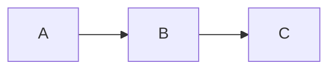

# 샘플 문서

이 문서는 md2html 통합 테스트용 fixture다.

## 개요

- **상태:** Draft
- 인라인 코드 `POST /v1/messages`

## 사용 시나리오
- [x] 완료된 시나리오
- [ ] 미완료 시나리오
- [ ] 또 다른 미완료

## 다이어그램



## 코드

```go
package main

func main() { println("hi") }
```

## 관련 문서

- [디자인 문서](./design.md)
- [외부 링크](https://example.com)
- [이미지](./pic.png)

### 하위 섹션

본문 끝.
